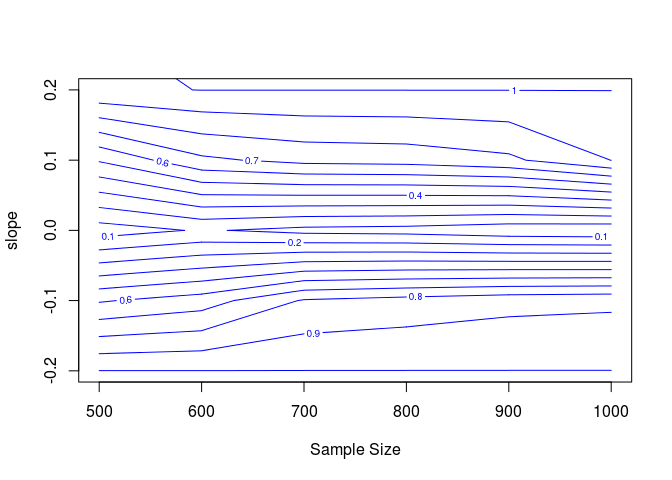

# Assignment3
Emily Dolson  
11/01/2014  
# 1. A.


Perspective plot:

 

Contour plot:

 

Fancy contour plot:

 

Scree plot:


```
## Loading required package: lattice
```

```
## [1] 10 10
```

```
## [1] "power.b.t[1,] + power.b.t[2,] + power.b.t[3,] + power.b.t[4,] + power.b.t[5,] + power.b.t[6,] + power.b.t[7,] + power.b.t[8,] + power.b.t[9,] + power.b.t[10,]"
```

```
## power.b.t[1, ] + power.b.t[2, ] + power.b.t[3, ] + power.b.t[4, 
##     ] + power.b.t[5, ] + power.b.t[6, ] + power.b.t[7, ] + power.b.t[8, 
##     ] + power.b.t[9, ] + power.b.t[10, ] ~ sample_size
```

 

1. I find either the perspective plot or the fancy contour plot to be most useful to me, because both allow me to see at a glance what regions of parameter space have what levels of power. The non-fancy contour plot and scree plot take a little more effort for me to interpret, although the scree plot allows for more exact estimates of power under specific conditions (particularly since it would be possible to add error pars to the scree plot).

2. This is a 3d scatter plot of all of the p values obtained at the different parameter settings. This allows you to get a sense of the shape of the distribution across the parameter space and see the notable drop-off in the spread of p-values as sample size and slope increase.


```
## Loading required package: scatterplot3d
```

 

3. In order to change the amount of un-modeled variation you would just need to increase the standard deviation used in the call to rnorm in the line in the inner for loop where y_sim is populated.

4. To change alpha, the line where the number of p-values for which the null hypothesis is rejected needs to be changed. The line to be changed is: `power.size[j] <- length(p[p<0.05])/N`, and .05 would need to be changed to the new alpha value.

5. The steps to perform a power analysis without p-values would be as follows:
*1. Simulate y values for the range of sample and effect sizes in which you are interested.
*2. Within each of these conditions, calculate confidence intervals for the y values.
*3. Calculate the percentage of confidence intervals in each condition that don't include 0.
(of course, this isn't really that different than a p-value... maybe you have something more different in mind that I'm not thinking of)

B. 


Perspective plot:
 

Contour plot:
 

Fancy contour plot:
 

Scree plot:
 

This surface looks very different because the effect sizes (slopes) now range from negative 5 to positive 5. As a result, the most extreme effect in this analysis is less extreme than the most extreme in the previous analysis, and there is effectively a power valley between the two most extreme points. This makes sense, as no test will be able to detect an effect of size 0, and effects will get progressively harder to detect as their sizes approach zero. As before, the perspective plot is more useful for getting a general sense of the shape of the relationship between power, sample size, and effect size, but the xyplot is more useful for getting exact values. In general, larger slopes and sample sizes increase power. This makes sense, as larger slopes mean the expected values for the two distributions will be more different, and larger sample sizes reduce the probability that results occured by chance.

C. 
I just ran an addiitional set of 500 runs for this project in which diversity is able to vary continuously, through the use of random environments, rather than varrying within treatment blocks. This is the subset of my dataset which I will use here. Additionally, I am only using data from the end points of the runs, to avoid the weird temporal auto-correlation discussed in the previous assignment which completely violates the assumptions of a linear model.

The linear model I'll be using is: `ent_div_lm <- lm(ShannonDiversityPhenotype ~ (ent+(EQU>0)+overlap)^2, data=endPoints)`, in which I am attempting to predict phenotypic Shannon diversity based on ent (entropy of the environment), overlap (the average number of resources available per cell), and a boolean indicating whether or not EQU evolved, as this variable can confound the results. The fundamental question is to what extend environmental entropy affects phenotypic diversity. Therefore, the fundamental question is whether or not the contribution of environmental entropy is significantly different from 0. As such, it is appropriate to use the p-value of the coefficient of ent. The power analysis, then, will provide information about the effect sizes I would be able to detect with the sample size that I used (500).


1. I am interested in the potential range of effect sizes that entropy could have on phenotypic diversity, so I will be varrying the mean of the distribtion from which the coefficient of ent is selected. The greatest reasonable slope would be 1, as this represents a scenario in which every cell in the environment is occupied by either the optimal phenotype or a more rare one, resulting in any increase in environmental entropy correspondingly increasing phenotypic entropy. It is also theoretically possible for environmental entropy to have a negative impact on phenotypic entropy (I even just came across a paper showing that this happens if only one phenotypic trait is allowed), although highly unlikely in this setup. As such, I will examine a series of slopes from -1 to 1. Since I could theoretically collect more data, I will also vary sample size to see if using a greater value than the 500 I am currently using would be useful.


2.
Perspective plot:
 

Contour plot (zoomed in for legiibility):
 

Fancy contour plot:
 

Scree plot:
 

These results suggest that the magnitude of the effect size would have to be very small in order for me to fail to detect the effect when it was present. For very small effect sizes, increasing sample size would potentially be useful. However, preliminarily, the effect size seems to be large enough that my sample size is adequate to detect it. The standard alpha seems appropriate. If anything my experiment is over-powered and I should use a lower alpha level.

#2.
A.   

Method | Model used for generating data | Good for p-values? | Good for confidence intervals? |  
-------|--------------------------------|--------------------|--------------------------------|  
Monte Carlo under Null | Null | Yes | No |  
Monte Carlo under Full | Full | Yes | Yes |  
Permutaion test | Null | Yes | No (requires a lot of assumptions) |  
Residual non-parametric Bootstrap | Full | Yes | Yes |  
Pairs non-parametric Bootstrap | Null | Yes | Yes |  

Some methods are only useful for p-values rather than for full confidence intervals because generating confidence intervals requires a greater knowledge of the shape of the full distribution. This can require either more thorough sampling (either in the simulation or in the original dataset), or additional assumptions. Any method that is good for generating confidence intervals is also good for generating p-values, because looking at whether or not a confidence interval overlaps 0 gives you the same information as a p-value.

B.


```r
ent_div_lm <- lm(ShannonDiversityPhenotype ~ ent+(EQU>0)+overlap, data=endPoints)
confint(ent_div_lm)
```

```
##               2.5 % 97.5 %
## (Intercept) 0.65458 1.4503
## ent         0.28987 0.4680
## EQU > 0TRUE 0.37502 0.6523
## overlap     0.01219 0.8755
```

Since this model turns out to be uninteresting (ent is crazily significant), I will also do some tests on the interaction between entropy and overlap in this model:


```r
interaction_lm <- lm(endPoints$ShannonDiversityPhenotype ~ endPoints$ent*endPoints$overlap)
confint(interaction_lm)
```

```
##                                   2.5 %  97.5 %
## (Intercept)                      1.4743  2.3269
## endPoints$ent                    0.2904  0.4689
## endPoints$overlap                0.7286  1.6395
## endPoints$ent:endPoints$overlap -1.5334 -0.8681
```

C. 


Results:
N = 50:  

Replicate | p-value | Confidence interval  
----------|----------|-------------------  
1 | 0 | 0.2830 - 0.4456  
2 | 0 | 0.2904 - 0.4735  
3 | 0 | 0.3054 - 0.4427   
4 | 0 | 0.3082 - 0.4256  
5 | 0 | 0.2946 - 0.4630  

The effect was so large that there was no change in p-value from replicate to replication - an effect greater than or equal to the one observed in the data was never produced under the null model. The confidence intervals, however, fluctuate slightly between tests. They never overlap 0, which is consistent with the p-values. These p-values and confidence intervals are kind of like an empirically collected data set answering the questions solved analytically using classical frequentist approaches, in that we are very literally assuming that the null hypothesis is true and asking how frequently we would expect to observe results as extreme as we did in the dataset. The primary difference here is that the extreme tails of the distribution are given less weight in simulation tests. In frequentist tests, we always know that there is a very small possibility of seeing an extreme value. In simulation tests, while the same probability exists for generating such a value, we don't incorporate it into the p-value or confidence interval if we don't see it. Hence, it is possible to get p-values equal to 0 in this framework, despite the fact that there is technically a non-zero probability that it is true.

(The interaction model also yielded p-values = to 0, so it is not included here as it does not give me the opportunity to demonstrate additional analysis)

N = 5000:  

Replicate | p-value | Confidence interval  
----------|----------|-------------------  
1 | 0 | 0.2891 - 0.4654  
2 | 0 | 0.2917 - 0.4694  
3 | 0 | 0.2884 - 0.4653  

The larger sample size seems to have resulted in confidence interval bounds that are closer to each other beteen times the analysis is run. If the p-values were non-zero, they would likely also be more similar to each other. This makes sense, because the larger sample size means that a more representative sample of potential values that could have been generated is taken each time. If the distributional assumptions were completely correct, this would be exactly the same as having a larger sample size in the real data-set. Since this is unlikely to be the case, the effect will be subtely different, but the concept is the same.

D. 


N = 50:  

Replicate | p-value   
----------|----------  
1 | 0   
2 | 0    
3 | 0    
4 | 0  
5 | 0  

N = 5000:  

Replicate | p-value  
----------|----------  
1 | 0   
2 | 0   
3 | 0  

(The interaction model also had p-values of 0 for everything so results are not shown)

These results further support the idea that it is highly unlikely that environmental entropy does not have an effect on diversity. So unlikely, in fact, that a more extreme p-value than the one in the actual model was never observed. On the face of it, this seems a bit unlikely, since it's always possible, for instance, that some entropies might be matched with the values that they originally belonged with. However, the p-value of the term in the model is 2.222418e-26, which is incredibly low, and the size of the dataset makes correct re-pairing of values unlikely. The histogram shows that the p-values are roughly uniformly distributed between 0 and 1, with slightly more towards to the left tail. This makes sense, because the randomization is generating models with correlations between entropy and diversity that are randomly distributed across the possible values. These values are being produced under a null model.

E.

```r
#The boot library doesn't like the fact that the the non-interaction model has a p-value of 0, so here is some code for that
model <- ent_div_lm
x <- model.matrix(model)
# Residual (Fixed) non-parametric Bootstrap
resid.lm.boot <- function(resids = resid(model), X = x ) {
  Y <- coef(model)[1] + coef(model)[2:4] * X + sample(resids, length(resids), replace=T) # generating new values for each y[i] (vector Y), by adding the bootstrapped residuals to the fitted model.
  model.boot <- lm( Y ~ endPoints$ent+(endPoints$EQU>0)+endPoints$overlap) # refit model with new Y values
  coef(model.boot) # Extract the co-efficients
}
vals <- replicate(5000, resid.lm.boot()[2])
p <- vals[vals >= coef(model)[2]]/5000
hist(vals, xlab="Coefficient of ent")
```

 

```r
#The interaction model is a little less ridiculously significant, so the Boot library can handle it
library(car)

#Residual bootstrap
resid_bootstrap <- Boot(interaction_lm, R=5000, method="residual")
```

```
## Loading required package: boot
## 
## Attaching package: 'boot'
## 
## The following object is masked from 'package:car':
## 
##     logit
## 
## The following object is masked from 'package:lattice':
## 
##     melanoma
```

```r
hist(resid_bootstrap)
```

 

```r
confint(resid_bootstrap)
```

```
## Bootstrap quantiles, type =  bca 
## 
##                                   2.5 %  97.5 %
## (Intercept)                      1.4797  2.3321
## endPoints$ent                    0.2887  0.4686
## endPoints$overlap                0.7182  1.6407
## endPoints$ent:endPoints$overlap -1.5267 -0.8642
```

```r
#Pairs bootstrap
pairs_bootstrap <- Boot(interaction_lm, R=5000, method="case")
hist(pairs_bootstrap)
```

 

```r
confint(pairs_bootstrap)
```

```
## Bootstrap quantiles, type =  bca 
## 
##                                   2.5 %  97.5 %
## (Intercept)                      1.5166  2.3124
## endPoints$ent                    0.2925  0.4602
## endPoints$overlap                0.7632  1.6119
## endPoints$ent:endPoints$overlap -1.5086 -0.8766
```

As expected, these histograms follow a roughly normal distribution. This makes sense, because they are sampling distributions and as such are subject to the central limit theorem.

F. 

Replicate | p-value | Confidence interval  
----------|----------|-------------------
Original ent coefficient | NA | 0.28987 - 0.4680
Monte Carlo 1 | 0 | 0.2891 - 0.4654  
Monte Carlo 2 | 0 | 0.2917 - 0.4694  
Monte Carlo 3 | 0 | 0.2884 - 0.4653  
Permutation 1 | 0 |   
Permutation 2 | 0 |   
Permutation 3 | 0 |
Residual bootstrap | 0 | 0.2901088 - 0.4659092
Pairs bootstrap | 0 | 0.2942720 - 0.4640141

Thse results are highly similar in that all of the p-values are 0. The confidence intervals are also incrediblely similar. This suggests that the estimates for the coefficient of entropy are accurate. The miniscule differences are likely due to random sampling variation. 
